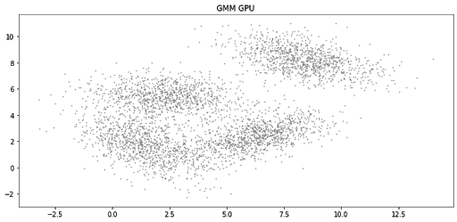
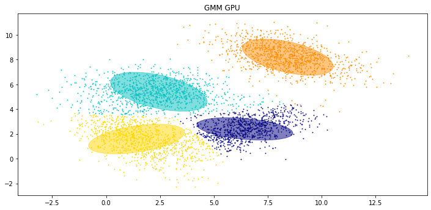

**University of Pennsylvania, CIS 565: GPU Programming and Architecture, Final Project: Point Cloud Registration Using Gaussian Mixure Models**

* SOMANSHU AGARWAL [LinkedIn](https://www.linkedin.com/in/somanshu25)
* SRINATH RAJAGOPALAN [LinkedIn](https://www.linkedin.com/in/srinath-rajagopalan-07a43155)
* DHRUV KARTHIK [LinkedIn](https://www.linkedin.com/in/dhruvkarthik/)

 

## Table of Contents

1. [Introduction](#Introduction)
2. [Gaussian Mixure Models](#Gaussian-Mixure-Models)
3. [Probabilistic Models vs ICP](#Probabilistic-Models-vs-ICP)
4. [Algorithms](#Effects)
5. [Use Cases](#Optimization)
6. [Performance Analysis](#Analysis)
7. [Future Work](#Future-Work)
8. [References](#References)

## Introduction

Point cloud registration is greatly used in the field of computer vision applications such as localization technically, to merge maps produced by different sensors. Using detereministic approached such as Iterative Closest point (ICP) works well for some of the cases, but it suffers the issue of coverging to local minima and not aligning the poinclouds properly, especially in case where a dense point cloud data has to be aligned to the saprse one. One of the ways to improve this limitation is to use probablistic models and learn distributions on the point cloud data and align the distributions itself. Hence, each point in the source point cloud is associated with a set of points in the target point cloud; each association is then weighted so that the weights form a probability distribution. We are using Gaussian Mixure Model which is driven by expectation maximization algorihtm to learn the distributions on the point cloud data and align them. We will be comparing the CPU and GPU implementation and showcase some of the applications such as unsupervised segmentation and localization. Later on, we will demonstrate a faster approach of GMM model, using Hierarchical Gaussian Mixure Model to learn the distirbutions in logarithmic time. 

## Gaussian Mixure Models

Gaussian Mixure Model (GMM) is the unsupervised probabilistic modelling technique for representing normally distributed subpopulations within an overall population. This is unsupervised as we do not have information about the subpopulations. We estimate the information about subpopulations using Expectation-maximization algorithms. We can apply GMM modelling to both 2D and 3D points to represent the clustering points in the space. The 2D and 3D representations are shown in the figures below.

### Gaussian Mixure Models for 2D Dataset:

Before Clustering            |  After Clustering
:-------------------------:|:-------------------------:
|  

### Gaussian Mixure Modelling for 3D Dataset

The Gaussian Mixure Models are implemented on Stanford Bunny for visualizing GMM in 3D point cloud data. The below two gifs show for 100 and 800 components respectively.

100 Components             |  800 Components
:-------------------------:|:-------------------------:
| 		

## Probabilistic-Models-vs-ICP

Iterative Closest point (ICP) algorithm is point to poitn approach where we try to match the correspondence for each source to the target point cloud data. The algorithms tries to align each source point to its nearest target point by using the SVD optimization to get the transformation parameters (Rotation and translational in case of rigid transformation) and we kepp doing the process iteratively till the loss converges to a minimum value. The drarback of the above algorithm is that it tries to align source's center of mass with the target one. In this process, the optimization might converge to the local minima where the point cloud data are not purely aligned, as mentioned in the figures below.

 

Probablistic ways tend to work better in case of computer vision applications which we have studies in our project work.

## Algorithms 

In our project, we have looked at various algorithms to perform Gaussian Mixure Models. We have looked at the standard Gaussian mixure model algorithm with full, disagonal and spherical covariances updates. 

## Use cases

### Unsupervised Segmentation

### Localization

## Performance Analysis

The performance analysis of CPU and GPU implmentations are shown below:

The above graphs mention that GPU performance improves with respet to our CPU implementation of point cloud registration.

## References
1. [Point Clouds Registration with Probabilistic Data Association](https://ieeexplore.ieee.org/stamp/stamp.jsp?tp=&arnumber=7759602&tag=1)
1. [Fast and Accurate Point Cloud Registration
using Trees of Gaussian Mixtures](https://arxiv.org/pdf/1807.02587.pdf)
